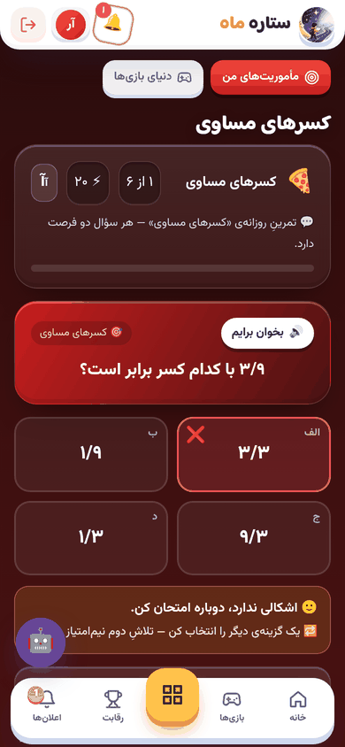
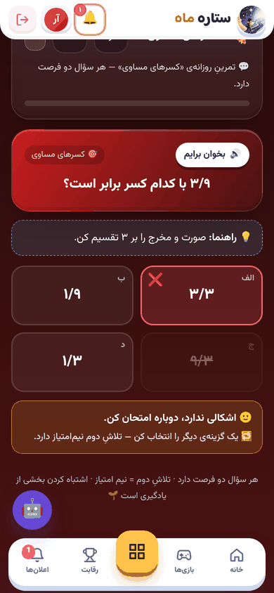
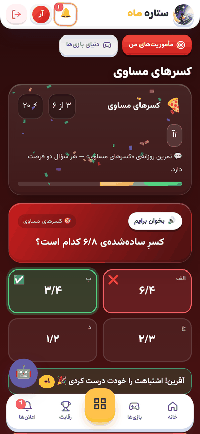
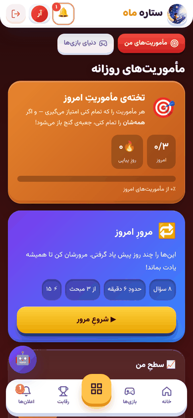
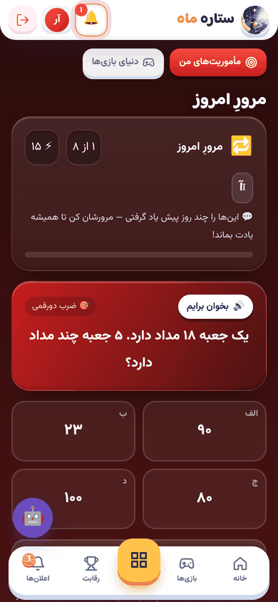
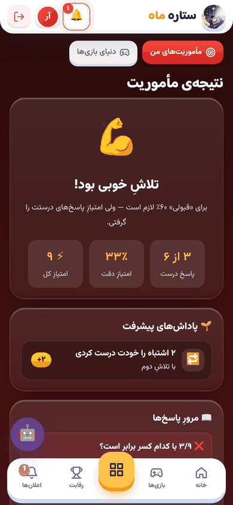
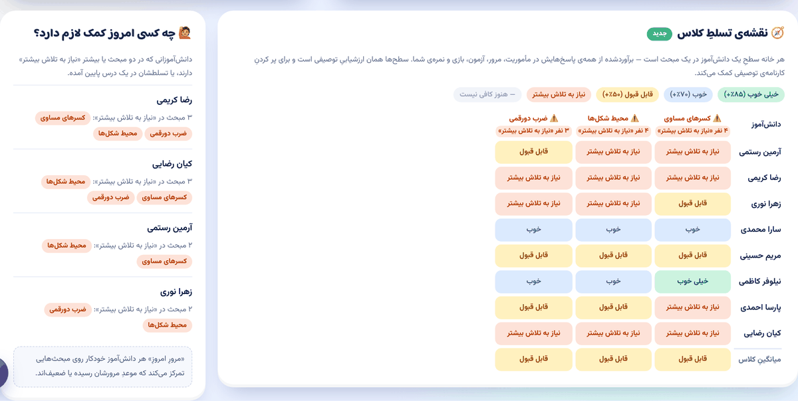
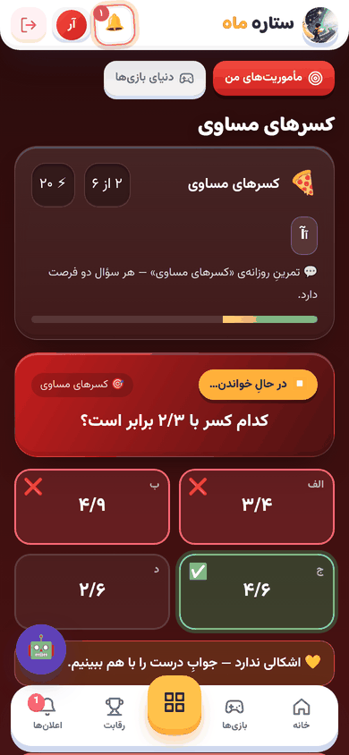
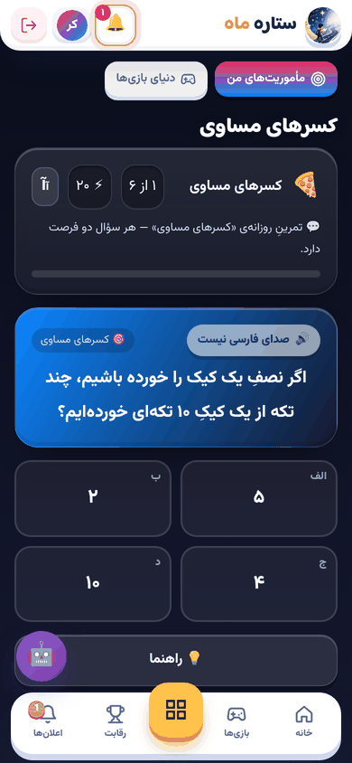

# راهنمای «هسته‌ی یادگیری» (فاز ۱)

این راهنما توضیح می‌دهد شش امکانِ تازه‌ی فاز ۱ چه می‌کنند، دانش‌آموز چه می‌بیند، معلم چطور از آن‌ها استفاده کند و پشتِ هر کدام چه منطقِ آموزشی‌ای هست.

| امکان | برای چه کسی | کجا |
|---|---|---|
| ۱. بازخوردِ همان لحظه، راهنما و تلاشِ دوم | دانش‌آموز | هر «مأموریتِ سؤالی» |
| ۲. مرورِ امروز (مرورِ فاصله‌دار) | دانش‌آموز | تخته‌ی «مأموریت‌های من» |
| ۳. سطحِ من در هر مبحث | دانش‌آموز، والدین | تخته‌ی مأموریت‌ها و کارنامه |
| ۴. پاداش برای پیشرفت | دانش‌آموز | صفحه‌ی نتیجه‌ی مأموریت |
| ۵. نقشه‌ی تسلطِ کلاس و «چه کسی کمک لازم دارد؟» | معلم | پنلِ معلم ← گزارش‌ها |
| ۶. «بخوان برایم» و متنِ درشت | دانش‌آموز (به‌ویژه اول تا سوم) | مأموریت، بازی و آزمونِ هوشمند |

---

## ۱. بازخوردِ همان لحظه، راهنما و تلاشِ دوم

**دانش‌آموز چه می‌بیند:**
- بعد از هر انتخاب، همان لحظه سبز یا قرمز می‌شود.
- اگر اشتباه کند، **یک فرصتِ دیگر** دارد و پیامِ «یک گزینه‌ی دیگر را انتخاب کن» می‌آید.
- دکمه‌ی **💡 راهنما** دو کار می‌کند:
  - متنِ راهنمایی را که معلم برای سؤال نوشته نشان می‌دهد؛
  - اگر سؤال بیش از دو گزینه داشته باشد، یک گزینه‌ی غلط را خط می‌زند.
- بعد از جوابِ درست، یا بعد از دو تلاش، **پاسخِ درست و «چرا؟»** (توضیحِ سؤال) نشان داده می‌شود.

**نمره و امتیاز:**

| نتیجه‌ی هر سؤال | سهم از امتیاز |
|---|---|
| درست در بارِ اول | کامل |
| درست با راهنما | سه‌چهارم |
| درست در تلاشِ دوم | نیم |
| دو بار غلط | صفر |

- امتیازِ هر مأموریت مثل قبل **روزی یک‌بار** داده می‌شود؛ تکرار در همان روز فقط تمرین است.
- نمره فقط در سرور حساب می‌شود و پاسخِ درست هیچ‌وقت زودتر از موقع به گوشیِ بچه فرستاده نمی‌شود، پس تقلب با ابزارهای مرورگر ممکن نیست.

**چرا:** بازخوردِ فوری و فرصتِ اصلاح، از مؤثرترین عواملِ یادگیری در پژوهش‌های ارزشیابیِ تکوینی است (Black & Wiliam؛ فراتحلیل‌های Hattie). بچه دلیلِ اشتباهش را وقتی می‌فهمد که هنوز در ذهنش است، نه آخرِ کار.

> 💡 **نکته برای معلم:** بیشترین اثر وقتی است که برای سؤال‌هایتان **«راهنما»** و **«توضیح»** بنویسید. راهنما سرنخ بدهد، نه جواب؛ مثلاً «صورت و مخرج را بر ۳ تقسیم کن». توضیح بگوید «چرا»؛ مثلاً «۳÷۳=۱ و ۹÷۳=۳؛ پس ۳/۹ = ۱/۳». اگر راهنما ننویسید، سیستم فقط یک گزینه‌ی غلط را حذف می‌کند.

---

## ۲. مرورِ امروز

هر روز روی تخته‌ی مأموریت‌ها یک کارتِ بنفش با عنوانِ **«مرورِ امروز»** می‌آید: حدودِ ۸ سؤال که سیستم برای همان دانش‌آموز انتخاب کرده است.

**سؤال‌ها چطور انتخاب می‌شوند:**
- حدودِ **پنج سؤال** از مبحث‌هایی است که بچه این هفته تمرین کرده (درسِ جاری)، و حدودِ **سه سؤال** از مبحث‌هایی که **موعدِ مرورشان رسیده** یا بچه در آن‌ها ضعیف است.
- سؤال‌ها **درهم** می‌آیند: هیچ مبحثی دو بار پشتِ سرِ هم نمی‌آید و هیچ مبحثی بیش از نیمی از سؤال‌ها را نمی‌گیرد.
- فقط از سؤال‌های **تأییدشده‌ی** بانک که معلمِ همان کلاس به آن‌ها دسترسی دارد.
- سؤالی که بچه امروز در بارِ اول درست جواب داده، امروز دوباره نمی‌آید.

**موعدِ مرور (جعبه‌ی لایتنر):** برای هر دانش‌آموز و هر مبحث، یک «جعبه» نگه داشته می‌شود.

| جعبه | مرورِ بعدی |
|---|---|
| ۱ | فردا |
| ۲ | ۳ روز بعد |
| ۳ | ۷ روز بعد |
| ۴ | ۱۴ روز بعد |
| ۵ | ۳۰ روز بعد |

بعد از هر جلسه:
- اگر همه‌ی سؤال‌های آن مبحث **در بارِ اول و بدونِ راهنما** درست بود، مبحث یک جعبه جلو می‌رود؛
- اگر **یکی** غلط بود، به جعبه‌ی ۱ برمی‌گردد؛
- اگر با راهنما یا تلاشِ دوم درست شد، در همان جعبه می‌ماند.

جعبه برای هر **جلسه** یک‌بار جابه‌جا می‌شود، نه برای هر پاسخ؛ پس ۵ جوابِ درست در یک روز، مبحث را یک‌باره به ۳۰ روز بعد نمی‌برد. پاسخ‌های **آزمونِ هوشمند** و **بازی** هم موعدِ مرور را به‌روز می‌کنند، به شرطی که سؤالشان از بانک آمده باشد.

- امتیازِ مرور: روزی یک‌بار، تا ۱۵ امتیاز.
- مرور، رشته‌ی **روزهای پیاپی** را هم زنده نگه می‌دارد.

**کِی کارت دیده نمی‌شود:** اگر بچه هنوز تمرینی نکرده یا کمتر از ۴ سؤالِ مناسب در بانک باشد، کارت نمی‌آید. اگر مرورِ امروز انجام شده باشد، کارت سبز می‌شود و «فردا دوباره» می‌گوید.

**چرا:** چیزی که امروز یاد گرفته می‌شود و دیگر پرسیده نمی‌شود، در چند هفته فراموش می‌شود (منحنیِ فراموشیِ Ebbinghaus). یادآوریِ فعال در فاصله‌های رو به افزایش (Cepeda؛ Roediger & Karpicke)، و درهم‌چیدنِ مبحث‌ها (Rohrer)، ماندگاریِ یادگیری را چند برابر می‌کند.

---

## ۳. سطحِ من در هر مبحث، با همان چهار سطحِ ارزشیابیِ توصیفی

سطح‌های تسلط در **همه‌جای سایت** (کارنامه، پنلِ والدین، نقشه‌ی معلم، تخته‌ی مأموریت‌ها) حالا همان عنوان‌های **ارزشیابیِ توصیفیِ دبستان** را دارند:

| سطح | تسلطِ برآوردشده |
|---|---|
| 🏆 خیلی خوب | ۸۵٪ و بالاتر |
| 🚀 خوب | ۷۰ تا ۸۴٪ |
| 🌱 قابل قبول | ۵۰ تا ۶۹٪ |
| 💪 نیاز به تلاش بیشتر | زیرِ ۵۰٪ |

- عددِ تسلط را **همان موتورِ تسلطِ کارنامه** حساب می‌کند. این موتور همه‌ی شواهد را کنارِ هم می‌گذارد: آزمون، بازی، مأموریت، مرور، تکلیف و نمره‌ی معلم.
  - کارِ تازه‌تر وزنِ بیشتری دارد.
  - جوابِ درست به سؤالِ سخت شاهدِ قوی‌تری است.
  - نمره‌ی خودِ معلم قوی‌ترین شاهد است.
- حالا پاسخ‌های مأموریت و مرور **سؤال‌به‌سؤال** ثبت می‌شوند، با «تلاشِ دوم» و «راهنما»، و هر پاسخ به **مبحثِ خودش** می‌رود. پیش از این فقط نمره‌ی کلِ روزِ مأموریت ثبت می‌شد.
- تا وقتی شواهد کم است (کمتر از ۳ پاسخ، یا یک نمره‌ی معلم)، به‌جای عدد نوشته می‌شود **«هنوز کافی نیست»**؛ یک جوابِ غلط بچه را «صفر» نمی‌کند.

> 📝 **برای کارنامه‌ی توصیفی:** نقشه‌ی تسلط (بخشِ ۵) نشان می‌دهد هر بچه در هر مبحث در کدام سطح است. این یک پیش‌نویسِ مستند است؛ داوریِ نهایی همیشه با شماست.

---

## ۴. پاداش برای پیشرفت، نه فقط درستی

در صفحه‌ی نتیجه، بخشِ **«🌱 پاداش‌های پیشرفت»** آمده است:

| رویداد | پاداش |
|---|---|
| 🚀 رکوردِ شخصیِ تازه (بهتر از بهترین نتیجه‌ی روزهای قبل در همین مأموریت) | ۵+ |
| 🔁 هر اشتباهی که بچه در تلاشِ دوم خودش درست کرده | ۱+ (حداکثر ۵) |
| ⬆️ وقتی یک مبحث **برای اولین بار** به سطحِ بالاتری می‌رسد | ۱۰+ |
| 🔥 نشانِ «۷ روز پیاپی» | نشان |

- نشانِ «۷ روز پیاپی» اصلاح شد. قبلاً به بچه‌ای داده می‌شد که در **یک روز** ۷ تمرین کرده بود؛ حالا واقعاً ۷ روزِ پشت‌سرِهم تمرین (مأموریت یا مرور) لازم است.
- این نشان حالا در همه‌ی مدرسه‌ها، نه فقط داده‌ی نمونه، خودکار ساخته می‌شود.

**چرا:** وقتی پاداش فقط برای «درست بودن» است، بچه‌های ضعیف‌تر هیچ‌وقت برنده نمی‌شوند و انگیزه‌ی درونی‌شان از بین می‌رود (نظریه‌ی خودتعیین‌گری، Deci & Ryan). پاداش برای **بهتر شدن از خودِ دیروز** و **اصلاحِ اشتباه** همان «ذهنیتِ رشد» است (Dweck) و به همه‌ی بچه‌ها شانسِ موفقیت می‌دهد.

---

## ۵. نقشه‌ی تسلطِ کلاس و «چه کسی امروز کمک لازم دارد؟» (برای معلم)

در **پنلِ معلم ← گزارش‌ها**، بالای صفحه:

**خواندنِ جدول:**
- **ردیف:** هر دانش‌آموزِ کلاس. **ستون:** مبحث‌هایی که کلاس بیشترین تمرین را در آن‌ها داشته (حداکثر ۱۲ ستون). اگر بیش از یک درس دارید، با دکمه‌های بالای جدول درس را عوض کنید.
- **هر خانه:** سطحِ آن بچه در آن مبحث. موس را روی خانه نگه دارید تا درصد و تعدادِ شواهد را ببینید. «—» یعنی هنوز شاهدِ کافی نیست.
- **⚠️ بالای ستون:** وقتی دستِ‌کم ۲۰٪ کلاس (و حداقل ۲ نفر) در آن مبحث «نیاز به تلاش بیشتر» دارند. شاید یک مرورِ کلاسیِ کوتاه لازم باشد.
- **↓ / ↑ کنارِ نام:** تسلطِ آن بچه در این درس در دو هفته‌ی اخیر دستِ‌کم ۱۰ درصد پایین یا بالا رفته است.
- **ردیفِ آخر:** میانگینِ کلاس در هر مبحث.

**«چه کسی امروز کمک لازم دارد؟»:** بچه‌هایی که
- در **دو مبحث یا بیشتر** «نیاز به تلاش بیشتر» دارند، یا
- تسلطشان در یک درس **۱۰٪ یا بیشتر افت** کرده است.

هر معلم فقط دانش‌آموزانِ کلاسِ خودش را می‌بیند. «مرورِ امروزِ» همین بچه‌ها هم خودکار روی همان مبحث‌های ضعیف تمرکز می‌کند.

> 💡 **برای این‌که جدول دقیق باشد:** در بانکِ سؤال، فیلدِ **«مبحث»** را پر کنید (مثلاً «کسرهای مساوی»). سیستم «هدفِ درسیِ» هر سؤال را از **پایه + درس + فصل + مبحث** می‌سازد. اگر مبحث خالی باشد، سؤال زیرِ عنوانِ فصل یا «درسِ N» می‌رود که کلی‌تر است. «ریاضی» و «ریاضی چهارم»، یا «ي» و «ی»، یکسان شناخته می‌شوند.

---

## ۶. «بخوان برایم» و متنِ درشت

- کنارِ هر سؤال در **مأموریت، مرور، بازی و آزمونِ هوشمند** دکمه‌ی **🔊 بخوان برایم** هست. صورتِ سؤال (و در مأموریت گزینه‌ها) را با **صدای فارسیِ خودِ دستگاه** می‌خواند؛ بدونِ هزینه و بدونِ ارسالِ چیزی به اینترنت.
- اگر دستگاه صدای فارسی نداشته باشد، دکمه خاکستری می‌شود و می‌نویسد «صدای فارسی نیست». در این حالت، اگر برای تبدیلِ متن به گفتارِ دستگاه بسته‌ی زبانِ فارسی موجود است، نصب کنید.
- **متنِ درشت:** برای پایه‌های **اول، دوم و سوم** به‌طورِ پیش‌فرض روشن است. هر بچه می‌تواند با دکمه‌ی «آآ» بالای مأموریت آن را روشن یا خاموش کند و انتخابش ذخیره می‌شود. متنِ درشت در صفحه‌های سؤال (مأموریت، بازی، آزمون) اعمال می‌شود.

**چرا:** بچه‌ای که هنوز روان نمی‌خواند، سؤالِ ریاضی را به‌خاطرِ خواندن غلط جواب می‌دهد، نه ریاضی. شنیدنِ صورتِ سؤال کنارِ دیدنش بارِ شناختی را کم می‌کند (دورمزگذاری، Paivio؛ اصولِ چندرسانه‌ایِ Mayer).

---

## پرسش‌های رایج

**کارتِ «مرورِ امروز» برای یک دانش‌آموز نمی‌آید.** باید دستِ‌کم یک مأموریتِ سؤالی (یا آزمون/بازیِ ساخته‌شده از بانک) انجام داده باشد، و دستِ‌کم ۴ سؤالِ تأییدشده در آن مبحث‌ها در بانک باشد.

**جدولِ تسلط خالی است.** وقتی بچه‌ها مأموریت، مرور، آزمون یا بازی انجام دهند، یا شما در دفترِ نمره نمره بدهید، پر می‌شود.

**چرا عددِ تسلط کمی محافظه‌کار است؟** موتورِ تسلط با شواهدِ کم عدد را به ۵۰٪ نزدیک نگه می‌دارد تا یک روزِ خوب یا بد، قضاوت را خراب نکند. با تمرینِ بیشتر، عدد به عملکردِ واقعی می‌رسد.

**بچه دوباره همان مأموریت را بازی کرد؛ تسلطش عوض نشد؟** درست است. امتیاز و شاهدِ یادگیری فقط بارِ اولِ هر روز ثبت می‌شود، چون تکرار بلافاصله بعد از دیدنِ پاسخ‌ها شاهدِ واقعیِ یادگیری نیست.

---

## بخشِ فنی (برای پشتیبانی)

**نصب روی هاست:** یک مایگریشنِ تازه دارد (`2026_10_09_010000_create_learning_mastery`). با سازوکارِ «اجرای خودکارِ مایگریشن پس از به‌روزرسانی» اجرا می‌شود، یا دستی: `php artisan migrate --force`. تا پیش از اجرای مایگریشن، امکاناتِ تازه بی‌صدا غیرفعال می‌مانند و هیچ صفحه‌ای خطای ۵۰۰ نمی‌دهد.

**جدول‌های تازه:**

| جدول | کاربرد |
|---|---|
| `learning_objectives` | فهرستِ سراسریِ هدف‌های درسی (پایه + درس + فصل + مبحث) |
| `practice_answers` | هر پاسخِ مأموریت/مرور، با «تلاشِ اول/دوم» و «راهنما» — شاهدِ موتورِ تسلط |
| `objective_reviews` | جعبه‌ی لایتنر و موعدِ مرورِ هر دانش‌آموز در هر هدف |
| `review_completions` | انجامِ «مرورِ امروز» (روزی یک‌بار) |
| `smart_question_bank.objective_id` | هدفِ درسیِ هر سؤال؛ با هر تغییرِ دسته‌بندی خودکار به‌روز می‌شود. سؤال‌های موجود در خودِ مایگریشن پر می‌شوند |

**داده‌ی نمایشی:** `php artisan db:seed --class=LearningDemoSeeder` فقط برای مدرسه‌ی نمونه (`starmah-demo`) این‌ها را می‌سازد:
- ۳۰ سؤالِ ریاضیِ چهارم در سه مبحث (کسرهای مساوی، ضربِ دورقمی، محیطِ شکل‌ها)، با راهنما و توضیح؛
- سه مأموریت؛
- ده روز سابقه‌ی تمرینِ شبیه‌سازی‌شده.

**تست‌ها:** `php artisan test tests/Feature/Learning` (۱۹ تست). موارد:
- لو نرفتنِ پاسخ؛ دو فرصت؛ رد شدنِ پاسخِ جعلی؛ نیم‌امتیاز؛ امتیاز یک‌بار در روز؛ بی‌اثر بودنِ توکنِ دانش‌آموزِ دیگر؛
- جعبه‌ی لایتنر و درهم‌چیدنِ مرور؛ ثبتِ موعدِ مرور از آزمونِ هوشمند و بازی؛ جداسازیِ مدرسه‌ها در مرور و نقشه‌ی معلم؛
- دوبار شمرده نشدنِ شواهد؛ نشانِ ۷ روزه؛ متنِ درشتِ پیش‌فرض.

**فایل‌های اصلی:**
- `app/Services/LearningService.php`: ثبتِ پاسخ، لایتنر، تشخیصِ ارتقای سطح.
- `app/Services/ReviewMissionBuilder.php`: ساختِ «مرورِ امروز».
- `app/Services/MasteryService.php`: موتورِ تسلط؛ منبعِ تازه‌ی سؤال‌به‌سؤال و عنوان‌های توصیفی.
- `app/Support/MasteryGrid.php`: نقشه‌ی معلم.
- `app/Support/Objectives.php`: ساختِ هدفِ درسی.
- `app/Http/Controllers/Student/MissionController.php`: بررسی، راهنما، پایان و مرور.
- `resources/js/Pages/Student/MissionPlay.jsx`
- `resources/js/Components/MasteryGrid.jsx`
- `resources/js/Components/ReadAloud.jsx`
